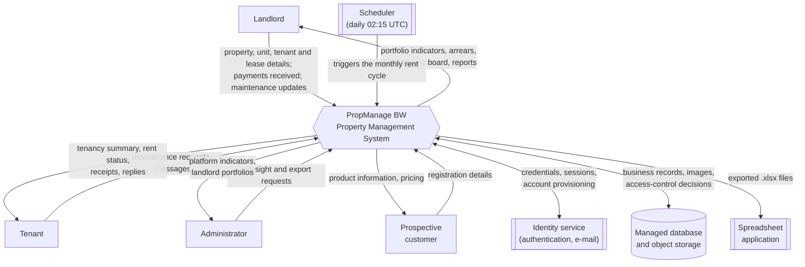
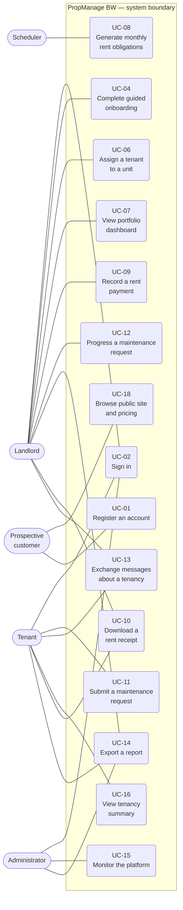
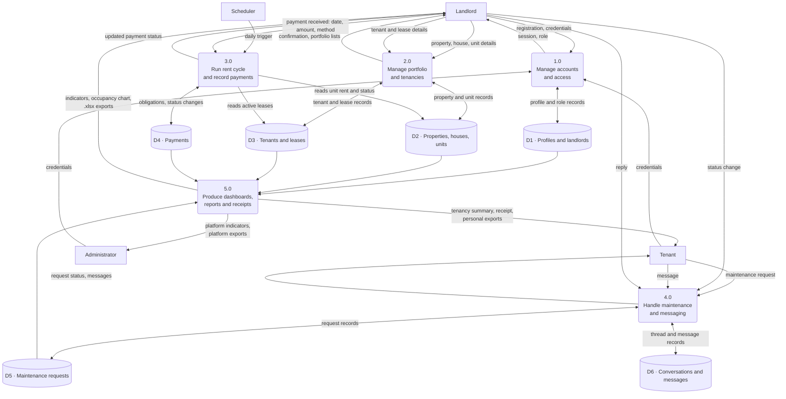
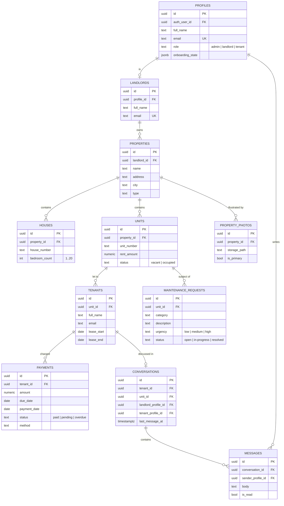

# Software Requirements Specification

## PropManage BW — Property Management System

| | |
|---|---|
| **Document title** | Software Requirements Specification (SRS) |
| **System** | PropManage BW — Property Management System |
| **Document version** | 1.0 |
| **Date** | 20 August 2026 |
| **Prepared by** | Georgy Moni |
| **Student ID** | 202100062 |
| **Course** | CSI 603 — Information Systems Engineering |
| **Assignment** | Assignment 1 — Development of a Software Requirements Specification |
| **Template followed** | IEEE Std 830-1998 (adapted, with IEEE/ISO/IEC 29148 influence) |
| **Status** | Issued for assessment |

### Revision history

| Version | Date | Author | Description |
|---|---|---|---|
| 0.1 | 06 May 2026 | G. Moni | Initial requirements capture from stakeholder discussions and system scoping. |
| 0.5 | 12 July 2026 | G. Moni | Functional and non-functional requirements expanded; use cases drafted. |
| 1.0 | 20 August 2026 | G. Moni | Baseline release. Requirements verified against the implemented system; future scope separated. |

---

## Table of Contents

1. [Introduction](#1-introduction)
   1.1 [Purpose](#11-purpose) · 1.2 [Scope of the System](#12-scope-of-the-system) · 1.3 [Definitions, Acronyms and Abbreviations](#13-definitions-acronyms-and-abbreviations) · 1.4 [References](#14-references) · 1.5 [Overview of the Document](#15-overview-of-the-document)
2. [Overall Description](#2-overall-description)
   2.1 [Product Perspective](#21-product-perspective) · 2.2 [Product Features](#22-product-features) · 2.3 [User Classes and Characteristics](#23-user-classes-and-characteristics) · 2.4 [Operating Environment](#24-operating-environment) · 2.5 [Design and Implementation Constraints](#25-design-and-implementation-constraints) · 2.6 [Assumptions and Dependencies](#26-assumptions-and-dependencies)
3. [Specific Requirements](#3-specific-requirements)
   3.1 [Functional Requirements](#31-functional-requirements) · 3.2 [Non-Functional Requirements](#32-non-functional-requirements) · 3.3 [External Interface Requirements](#33-external-interface-requirements) · 3.4 [Data Requirements](#34-data-requirements) · 3.5 [Planned Enhancements (Outside the Baseline)](#35-planned-enhancements-outside-the-baseline)
4. [Use Cases](#4-use-cases)
   4.1 [Actors](#41-actors) · 4.2 [Use Case Summary](#42-use-case-summary) · 4.3 [Detailed Use Cases](#43-detailed-use-cases)
5. [Appendices](#5-appendices)
   A [Glossary](#appendix-a--glossary) · B [Assumptions Register](#appendix-b--assumptions-register) · C [Diagrams](#appendix-c--diagrams) · D [Requirements Traceability Matrix](#appendix-d--requirements-traceability-matrix) · E [Quality Check Against Assessment Criteria](#appendix-e--quality-check-against-the-csi-603-assessment-criteria)

---

# 1. Introduction

## 1.1 Purpose

This document specifies the functional and non-functional requirements for **PropManage BW**, a web-based property management system for residential landlords operating in Botswana.

The purpose of this SRS is to:

- state precisely what PropManage BW must do, and how well it must do it, so that the specification can be used as the agreed basis for design, implementation, testing and acceptance;
- provide a single reference that is understood in the same way by all stakeholders — the product owner, developers, testers, and the landlords and tenants who use the system;
- define requirements that are individually **verifiable**, so that each one can be confirmed by inspection, demonstration, test or analysis before the system is accepted.

The intended readership is: the project supervisor and course assessor (CSI 603); the development team responsible for building and maintaining the system; the test engineer responsible for verification; and representative users (landlords and tenants) who validate that the requirements reflect real operational needs.

This document specifies **what** the system must do. It does not prescribe internal design or implementation detail, except where an existing technology decision genuinely constrains the requirements; those cases are recorded explicitly in §2.5.

## 1.2 Scope of the System

**PropManage BW** is a multi-tenant web application that allows a landlord to manage a residential property portfolio from a single interface, and allows tenants to see and act on their own tenancy information through a self-service portal.

### 1.2.1 Objectives

The system exists to replace the spreadsheets, notebooks and informal messaging that small and medium landlords in Botswana typically use. Its objectives are to:

1. hold a single, accurate record of properties, units, tenants and leases;
2. generate rent obligations automatically each month so that no rent is forgotten, and track each obligation through to payment;
3. make arrears visible immediately rather than at month end;
4. move maintenance reporting from phone calls into a tracked, auditable workflow;
5. give tenants direct access to their own rent status, receipts, maintenance requests and a communication channel with their landlord;
6. produce portfolio reports that can be opened in a spreadsheet application for accounting or tax purposes.

### 1.2.2 In scope

| # | Capability included in this baseline |
|---|---|
| S1 | Account registration, authentication, session management and role-based access for Administrators, Landlords and Tenants |
| S2 | Guided onboarding ("Quick Setup") for a new landlord: property, houses, units and first tenants |
| S3 | Property, house and unit records, including property photographs |
| S4 | Tenant records, lease periods and tenant-to-unit assignment |
| S5 | Automatic monthly rent obligation generation, overdue detection, and manual recording of received payments |
| S6 | Downloadable rent receipts for settled payments |
| S7 | Maintenance request submission by tenants and status tracking by landlords |
| S8 | Direct tenant-to-landlord messaging scoped to a tenancy |
| S9 | Landlord, tenant and administrator dashboards with portfolio indicators and charts |
| S10 | Spreadsheet (`.xlsx`) exports of payments, tenants and maintenance records |
| S11 | Platform administration: cross-portfolio oversight of landlords, properties, tenants and collections |
| S12 | A public marketing website and pricing pages whose content is maintained as data rather than code |

### 1.2.3 Out of scope for this baseline

The following are **explicitly excluded** from the requirements in §3.1 and §3.2. Those that are planned for a later release are specified separately in §3.5 so that the scope boundary is unambiguous.

| # | Excluded capability | Reason |
|---|---|---|
| X1 | Online rent collection through a payment gateway or mobile money | Payments are received outside the system and recorded by the landlord (see §3.5, FS-01) |
| X2 | Automated SMS or e-mail rent reminders and notifications | Planned for a later release (§3.5, FS-02) |
| X3 | Subscription billing and plan enforcement for the advertised price plans | Plans are advertised on the marketing site only; billing is not implemented (§3.5, FS-03) |
| X4 | Accounting-package integration (for example ledger posting or VAT return filing) | The system exports spreadsheets; downstream accounting remains a separate process |
| X5 | Tenant credit or background screening | Requires third-party data agreements not held by the product owner |
| X6 | Lease document generation, e-signature and document storage | Planned for a later release (§3.5, FS-05) |
| X7 | A native mobile application for iOS or Android | The system is delivered as a responsive web application usable on mobile browsers |
| X8 | Commercial and industrial property management (service charges, tenant fit-out) | The product is targeted at residential letting |

### 1.2.4 Baseline convention used in this document

Requirements in §3.1 to §3.4 describe the **agreed baseline** of the system. Capabilities that are intended but not part of the baseline are listed in §3.5 with `FS-` identifiers and are not to be treated as acceptance criteria for this release. Where a screen already presents a control for a planned capability, this is stated in §3.5 so that the reader does not mistake a placeholder for delivered behaviour.

## 1.3 Definitions, Acronyms and Abbreviations

| Term | Definition |
|---|---|
| **Administrator** | A platform operator who oversees all landlords and portfolios. Not the same as a landlord. |
| **Arrears** | Rent that is due and unpaid. |
| **BWP / Pula (P)** | Botswana Pula, the currency in which all monetary values are held and displayed. |
| **Landlord** | The owner or manager of one or more properties, and the principal paying user of the system. |
| **Lease** | The agreed period, with a start and end date, during which a tenant occupies a unit. |
| **Maintenance request** | A tenant-raised report of a defect or required repair, tracked through to resolution. |
| **Obligation** | A rent charge raised automatically for a tenant for a given month, before any payment is received. |
| **Portfolio** | The complete set of properties, units and tenants belonging to one landlord. |
| **Property** | A named site at an address, containing one or more houses or lettable units. |
| **Rent cycle** | The scheduled process that raises monthly rent obligations and marks unpaid obligations overdue. |
| **Tenant** | A person occupying a unit under a lease, and a self-service user of the system. |
| **Unit** | An individually lettable space within a property, with its own rent amount and occupancy status. |

| Acronym | Expansion |
|---|---|
| API | Application Programming Interface |
| BaaS | Backend as a Service |
| CAT | Central Africa Time (UTC+02:00), the local time zone of Botswana |
| CRUD | Create, Read, Update, Delete |
| DFD | Data Flow Diagram |
| ERD | Entity Relationship Diagram |
| FR | Functional Requirement |
| FS | Future Scope requirement (outside the current baseline) |
| JWT | JSON Web Token |
| KPI | Key Performance Indicator |
| NFR | Non-Functional Requirement |
| RLS | Row Level Security — database-enforced, per-row access control |
| RPO / RTO | Recovery Point Objective / Recovery Time Objective |
| SRS | Software Requirements Specification |
| SSR | Server-Side Rendering |
| TLS | Transport Layer Security |
| UC | Use Case |
| WCAG | Web Content Accessibility Guidelines |
| XLSX | Office Open XML spreadsheet file format |

## 1.4 References

| Ref | Source |
|---|---|
| [R1] | IEEE Std 830-1998, *IEEE Recommended Practice for Software Requirements Specifications*. IEEE, 1998. |
| [R2] | ISO/IEC/IEEE 29148:2018, *Systems and software engineering — Life cycle processes — Requirements engineering*. |
| [R3] | ISO/IEC 25010:2011, *Systems and software Quality Requirements and Evaluation (SQuaRE) — System and software quality models*. |
| [R4] | W3C, *Web Content Accessibility Guidelines (WCAG) 2.1*, W3C Recommendation, June 2018. |
| [R5] | CSI 603 Information Systems Engineering — *Assignment 1: Development of a Software Requirements Specification*, course handout. |
| [R6] | PropManage BW — *Cursor Build Guide* (`cursor.md`), internal design and page-flow specification. |
| [R7] | PropManage BW — database migration set (`supabase/migrations/`), the authoritative definition of the data model, access-control rules and the scheduled rent cycle. |
| [R8] | Next.js 14 App Router documentation, Vercel Inc. |
| [R9] | Supabase platform documentation — Auth, PostgreSQL, Storage and Row Level Security. |
| [R10] | Republic of Botswana, *Data Protection Act, 2018* — obligations relating to the processing of personal data. |

## 1.5 Overview of the Document

The remainder of this document is organised as follows.

- **Section 2 — Overall Description** places the system in its business and technical context, summarises its features at a high level, describes the classes of user, the operating environment, and the constraints, assumptions and dependencies under which it must be built.
- **Section 3 — Specific Requirements** contains the detailed, numbered requirements. §3.1 gives functional requirements (`FR-nn`), §3.2 gives non-functional requirements (`NFR-nn`) covering performance, security, usability, reliability and availability, maintainability and scalability, §3.3 gives external interface requirements, §3.4 gives data requirements, and §3.5 records planned capabilities that lie outside this baseline (`FS-nn`).
- **Section 4 — Use Cases** identifies the actors, summarises all use cases, and specifies the most significant ones in full.
- **Section 5 — Appendices** provides a glossary, the assumptions register, the supporting diagrams (system context, use case, data flow and entity relationship), a requirements traceability matrix, and a quality check against the assessment criteria.

Requirements are written using the following convention:

- **shall** — a mandatory requirement forming part of the acceptance criteria;
- **should** — a desirable requirement that may be traded off if justified;
- **may** — an optional or permissive statement.

Each requirement carries a stable identifier and a priority: **Essential** (the system is unacceptable without it), **Important** (significantly reduces value if absent), or **Desirable** (beneficial but deferrable).

---

# 2. Overall Description

## 2.1 Product Perspective

PropManage BW is a **new, self-contained product**. It does not replace a specific existing software system; it replaces manual practice — spreadsheets, paper receipt books, WhatsApp threads and phone calls — which is the current method used by the majority of small landlords in its target market.

Although self-contained from the user's point of view, the product is not isolated. It operates as the central node in the small ecosystem shown in the System Context Diagram (Appendix C.1):

| Neighbour | Relationship to PropManage BW |
|---|---|
| Landlords, Tenants, Administrators | Human actors who interact with the system through a web browser |
| Managed authentication service | Verifies credentials, issues and validates sessions, and sends account-related e-mail on the system's behalf |
| Managed relational database | Stores all business data and enforces per-row access control |
| Managed object storage | Stores property photographs and profile images |
| Scheduler | Triggers the monthly rent cycle on a fixed daily schedule, without human involvement |
| Spreadsheet application | Consumes the `.xlsx` reports the system exports; the system produces the file, the user's own software opens it |

### 2.1.1 System architecture

The product is a three-layer web application:

| Layer | Responsibility |
|---|---|
| **Presentation** | A responsive browser interface: a public marketing site, a landlord dashboard, a tenant portal and an administration console. Pages are rendered on the server where the content depends on the signed-in user's data. |
| **Application** | Server-side route handlers and server actions that validate input, apply business rules (lease validity, payment state transitions, export entitlement), and generate receipts and spreadsheet exports. |
| **Data** | A relational database holding all business entities, enforcing referential integrity and access control at row level, together with object storage for images and a scheduler for the rent cycle. |

A significant architectural property is that **authorisation is enforced in the data layer, not only in the interface**. Every table carries row-level security rules that restrict each row to the landlord who owns it, the tenant it concerns, or an administrator. A defect in the user interface therefore cannot, on its own, expose one landlord's portfolio to another. This property is the basis of requirements NFR-10 to NFR-13.

### 2.1.2 User interface overview

| Interface | Route | Primary user |
|---|---|---|
| Public marketing site and pricing pages | `/`, `/pricing/*` | Prospective customer |
| Registration and login | `/auth/register`, `/auth/login` | All users |
| Landlord dashboard and portfolio management | `/dashboard/*` | Landlord |
| Guided onboarding wizard | `/dashboard/onboarding` | Landlord (first use) |
| Tenant self-service portal | `/tenant/*` | Tenant |
| Administration console | `/admin/*` | Administrator |

## 2.2 Product Features

The following are the major features of the product. Each is expanded into numbered requirements in §3.1; the mapping is given in Appendix D.

| ID | Feature | Summary |
|---|---|---|
| PF-01 | **Accounts and role-based access** | Self-registration as a landlord or tenant, secure sign-in, and a landing experience determined by role. Protected areas are unavailable to unauthenticated visitors. |
| PF-02 | **Guided onboarding** | A three-step wizard that takes a new landlord from an empty account to a property with houses, units and tenants, and that remembers progress if interrupted. |
| PF-03 | **Portfolio management** | Records for properties, houses and lettable units, including bulk unit creation and property photographs. |
| PF-04 | **Tenant and lease management** | Assignment of a tenant to a unit for a defined lease period, with validation that prevents overlapping or contradictory assignments. |
| PF-05 | **Automated rent cycle** | Monthly rent obligations raised automatically for every active lease, and unpaid obligations marked overdue without manual intervention. |
| PF-06 | **Payment recording and receipts** | Recording of rent received outside the system, with a downloadable receipt available once a payment is settled. |
| PF-07 | **Maintenance workflow** | Tenant-raised requests with category and urgency, tracked by the landlord on a three-column board from open to resolved. |
| PF-08 | **Tenancy messaging** | A single, persistent message thread between a tenant and their landlord, scoped to the tenancy. |
| PF-09 | **Dashboards and analytics** | Portfolio indicators, recent activity and an occupancy chart for landlords; a tenancy summary for tenants; platform-wide figures for administrators. |
| PF-10 | **Reporting and export** | Spreadsheet exports of payments, tenants and maintenance records, scoped to the requesting user's role and stamped with generation metadata. |
| PF-11 | **Platform administration** | Cross-portfolio visibility of landlords, properties, tenants and monthly collections. |
| PF-12 | **Data-driven public site** | Marketing copy, pricing content and reference lists (cities, property types) held as data so they can be changed without a code release. |

## 2.3 User Classes and Characteristics

| Attribute | **Landlord** | **Tenant** | **Administrator** | **Prospective customer** |
|---|---|---|---|---|
| **Role in the business** | Owns or manages the portfolio; the paying customer | Occupies a unit under a lease | Operates the platform on behalf of the product owner | Evaluating the product |
| **Expected population** | Up to 500 in the first two years | 5–10 per landlord; up to 5,000 overall | 1–3 | Unbounded |
| **Frequency of use** | Daily to weekly | Monthly, rising around rent due dates | Weekly | Once |
| **Technical skill** | Low to moderate; comfortable with a browser and a spreadsheet, not with technical vocabulary | Low; may use the system only on a mobile phone | High; understands the data model and platform operations | Low to moderate |
| **Domain knowledge** | High — understands leases, arrears and maintenance | Moderate — understands their own tenancy only | Moderate | Low |
| **Primary device** | Laptop or desktop, with frequent mobile use | Mobile phone (predominant) | Laptop or desktop | Mobile or desktop |
| **Principal goals** | See what rent is outstanding; record payments; resolve maintenance; report to an accountant | Check rent status; obtain a receipt; report a fault; contact the landlord | Monitor platform health and adoption; support landlords | Understand what the product does and what it costs |
| **Privilege level** | Full control of own portfolio only | Read access to own tenancy; may create requests and messages | Read access across all portfolios | Public content only |
| **Consequence of error** | Financial — mis-stated arrears | Personal — an unrecorded payment or unreported fault | Systemic — affects all users | None |

**Design implication.** The landlord is the primary user class and receives the richest interface. The tenant class is the largest by population and is predominantly mobile, so tenant-facing screens are the ones for which the mobile-layout requirements (NFR-20, NFR-21) are strictest. Because tenants and landlords may have no formal training, plain-language error messages (NFR-22) are treated as a requirement rather than a nicety.

## 2.4 Operating Environment

| Element | Requirement |
|---|---|
| **Client platform** | Any device running a supported browser: Google Chrome, Microsoft Edge, Mozilla Firefox or Apple Safari, current version or one version behind; Chrome for Android and Safari for iOS on mobile |
| **Client hardware** | A device with at least 2 GB of RAM and a screen at least 320 px wide; no installation is required beyond the browser |
| **Client connectivity** | An Internet connection of at least 2 Mbit/s; the system must remain usable on a mobile data connection |
| **Server platform** | A managed cloud hosting service capable of running a Node.js 20 LTS server-rendered web application; the application tier holds no session state locally |
| **Data platform** | A managed PostgreSQL 15 service with row-level security, a job scheduler, an authentication service and object storage |
| **Application stack** | Next.js 14 (App Router), React 18, TypeScript 5, Tailwind CSS 3 |
| **Locale and currency** | English (Botswana); currency BWP displayed with the symbol **P**; dates shown as `DD Mon YYYY`; scheduled processing and audit timestamps recorded in UTC |
| **Deployment topology** | A single production environment served over HTTPS, with a separate development environment. A static export of the public marketing pages may additionally be published to a static host; that export contains public content only and no portfolio data |

## 2.5 Design and Implementation Constraints

| ID | Constraint | Origin and consequence |
|---|---|---|
| CON-01 | The system shall be delivered as a responsive web application; no native mobile application shall be required to access any function. | Product decision. Tenants must be able to use the system on any phone without installing software. |
| CON-02 | The system shall be built on the Next.js 14 App Router with React 18 and TypeScript. | Existing technology decision and team skill set. Constrains routing, rendering and the server-action model. |
| CON-03 | Business data shall be held in a managed PostgreSQL service, and access control shall be enforced by database row-level security in addition to any application-level checks. | Security decision. Requirements NFR-10 to NFR-13 depend on this. |
| CON-04 | Authentication shall be delegated to the managed identity service; the system shall not implement its own credential store, and shall never hold a password in a form from which it can be recovered. | Security decision. Removes a large class of credential-handling defects. |
| CON-05 | Scheduled processing shall be performed by the database scheduler, not by a process on the application tier. | Architectural decision. Allows the application tier to remain stateless and horizontally scalable (NFR-38). |
| CON-06 | All monetary values shall be held and presented in Botswana Pula (BWP). Multi-currency operation is not permitted in this release. | Market decision. |
| CON-07 | The interface shall follow the established visual system: Inter typeface, the defined corporate palette, and the shared component set. | Brand guideline. Ensures a consistent look across all screens. |
| CON-08 | Every change to the database schema shall be made through a versioned, timestamped migration script applied in chronological order. Direct modification of a production schema is prohibited. | Maintainability decision (NFR-33). |
| CON-09 | No secret, key or credential shall appear in source code or in the version control repository; all such values shall be supplied through environment configuration. | Security policy (NFR-17). |
| CON-10 | Personal data of tenants and landlords shall be processed in accordance with the Botswana Data Protection Act, 2018 [R10]. | Legal obligation. Drives NFR-14 and NFR-18. |
| CON-11 | The system shall depend only on the managed platform services already contracted; introducing a further paid third-party service requires product-owner approval. | Cost control for a product priced from P0 to P199 per month. |

## 2.6 Assumptions and Dependencies

### 2.6.1 Assumptions

These are conditions taken to be true. If one proves false, the affected requirements must be re-examined. The full register, with impact assessment, is in Appendix B.

| ID | Assumption |
|---|---|
| ASM-01 | Rent is received outside the system — by bank transfer, cash or mobile money — and the landlord records it afterwards. The system is a record of payment, not a means of payment. |
| ASM-02 | Rent is charged monthly, in advance, and is due on the first day of the month. Weekly, quarterly and pro-rata charging are not required. |
| ASM-03 | A unit is occupied by one tenant record at a time. Where several people share a unit, one is recorded as the tenant of record. |
| ASM-04 | Each landlord manages their own portfolio directly. Agency arrangements, in which one company manages property on behalf of several owners, are not required in this release. |
| ASM-05 | Every tenant who uses the portal has a personal e-mail address and a smartphone or computer with Internet access. |
| ASM-06 | The identity service is configured to require a password of at least 8 characters. |
| ASM-07 | Landlords accept that maintenance costs, supplier invoices and deposits are tracked outside the system in this release. |
| ASM-08 | Users operate in Botswana, in Central Africa Time, and are content for scheduled processing to be expressed in UTC. |
| ASM-09 | The advertised price plans are informational in this release; no plan limit is enforced by the software. |

### 2.6.2 Dependencies

| ID | Dependency | Effect if unavailable |
|---|---|---|
| DEP-01 | Managed authentication service | No user can sign in or register; the system is effectively unavailable |
| DEP-02 | Managed PostgreSQL database | No business data can be read or written; only the public marketing pages remain usable, served from built-in default content (FR-61) |
| DEP-03 | Managed object storage | Property photographs and profile images cannot be uploaded or displayed; all other functions continue |
| DEP-04 | Database job scheduler | Monthly rent obligations are not raised and overdue status is not updated until the schedule is restored; the process is idempotent, so a delayed run produces the correct result |
| DEP-05 | Managed application hosting | The system is unavailable |
| DEP-06 | Outbound e-mail through the identity service | Account confirmation and password-reset messages are not delivered; existing users can still sign in |
| DEP-07 | Reference data (cities, property types) held in the database | Property creation falls back to the built-in default lists (FR-63) |

---

# 3. Specific Requirements

## 3.1 Functional Requirements

Requirements are numbered continuously as `FR-01` to `FR-67` and grouped by functional area. Priority is **Essential**, **Important** or **Desirable**. The verification method for each requirement is given in Appendix D.

### 3.1.1 Account Management and Authentication

| ID | Requirement | Priority |
|---|---|---|
| FR-01 | The system shall allow a visitor to register an account by supplying a full name, an e-mail address, a password, a password confirmation, and a selected role of either **Landlord** or **Tenant**. | Essential |
| FR-02 | The system shall reject a registration in which any mandatory field is empty, the e-mail address is not a syntactically valid address, or the password and its confirmation differ. It shall display a message that identifies the specific problem and shall not create an account. | Essential |
| FR-03 | The system shall enforce the configured password policy of at least 8 characters at registration, reject a non-compliant password with an explanatory message, and display a strength indicator of *weak*, *medium* or *strong* as the password is typed. | Essential |
| FR-04 | On successful registration the system shall create an application profile linked to the authentication account, carrying the user's name, e-mail address and role; and where the selected role is Landlord, it shall additionally create the corresponding landlord record. Both records shall be created as a single outcome — either both exist or neither does. | Essential |
| FR-05 | Where a registration supplies no role, or a role other than Landlord or Tenant, the system shall assign the role **Landlord**. | Important |
| FR-06 | The system shall permit at most one account per e-mail address, compared without regard to letter case, and shall reject a second registration for the same address. | Essential |
| FR-07 | The system shall authenticate a returning user by e-mail address and password, establish a session on success, and on failure display "Invalid e-mail address or password" without indicating which of the two was wrong, and without creating a session. | Essential |
| FR-08 | Following successful authentication the system shall direct the user to the destination appropriate to their role: Administrator to the administration console, Tenant to the tenant portal, and Landlord to the landlord dashboard. | Essential |
| FR-09 | The system shall deny access to the landlord dashboard, tenant portal and administration console to any request without a valid session, redirecting the request to the login page. | Essential |
| FR-10 | Where a landlord has created a tenant record for an e-mail address before that person has registered, the system shall link the existing profile to the authentication account the first time that person signs in with the same address, compared without regard to letter case, so that the tenant immediately sees their tenancy. | Important |

### 3.1.2 Guided Onboarding

| ID | Requirement | Priority |
|---|---|---|
| FR-11 | The system shall provide a three-step onboarding wizard for a landlord — (1) property details, (2) houses and units, (3) tenants — and shall display which step is current and which are complete. | Important |
| FR-12 | The system shall record onboarding progress, including the current step and the identifier of any property created, against the landlord's profile, and shall resume at the recorded step when the landlord returns after leaving the wizard. | Important |
| FR-13 | The system shall create a property from a name, address, city and property type. The city and the property type shall be validated on the server against the reference lists, and a value outside those lists shall be rejected with the message "Please choose a valid city" or "Please choose a valid property type". | Essential |
| FR-14 | The system shall create a stated number of houses for a property in one operation, accepting between 1 and 100 houses each having between 1 and 20 bedrooms, numbering them sequentially as `H1` to `Hn`, and rejecting any value outside those ranges. If the houses cannot be created, the system shall remove the property it has just created, so that no property is left without its houses. | Important |
| FR-15 | The system shall create units in bulk, either by generating between 1 and 200 units using the pattern `A1…An` or `1…n`, or from a pasted list separated by line breaks or commas, of which at most the first 200 entries shall be used. Each created unit shall take the supplied default rent, which shall not be negative, and shall be given the status **vacant**. | Important |
| FR-16 | The system shall allow a landlord to upload photographs for a property and to designate one of them as the primary photograph. At most one primary photograph shall exist per property at any time. | Desirable |

### 3.1.3 Property and Unit Management

| ID | Requirement | Priority |
|---|---|---|
| FR-17 | The system shall present a landlord with a list of their properties showing, for each, the name, address, city, type, total number of units and number of occupied units. A landlord shall see only their own properties; an administrator shall see all properties. | Essential |
| FR-18 | The system shall present a property detail view listing every unit in that property with its unit number, rent amount, occupancy status and current tenant, together with the payment history for that property. | Essential |
| FR-19 | The system shall allow a landlord to add a single unit to a property by supplying a unit number, which is mandatory, and a rent amount, which shall not be negative. A unit so created shall be given the status **vacant**. | Essential |
| FR-20 | The system shall set a unit's status to **occupied** when a tenant is assigned to it, and shall treat a unit as occupied in all portfolio counts when a tenant record exists for it. | Essential |

### 3.1.4 Tenant and Lease Management

| ID | Requirement | Priority |
|---|---|---|
| FR-21 | The system shall allow a landlord to assign a tenant to a unit by supplying the tenant's full name, e-mail address, lease start date and lease end date, and optionally a rent amount that replaces the unit's current rent. | Essential |
| FR-22 | The system shall reject an assignment whose lease end date is earlier than its lease start date, with the message "Lease end must be after lease start", and shall create no records. | Essential |
| FR-23 | The system shall reject an assignment whose e-mail address is already assigned to another unit, and shall name the property and unit to which that address is currently assigned. | Essential |
| FR-24 | Where no account exists for the tenant's e-mail address, the system shall inform the landlord and require an explicit confirmation before proceeding; on confirmation it shall create a pending tenant profile that will be linked to that person's account when they first sign in (FR-10). | Important |
| FR-25 | On a successful assignment the system shall create the tenant record with its lease dates, set the unit status to **occupied**, and apply the rent override where one was supplied. | Essential |
| FR-26 | The system shall present a landlord with a list of their tenants showing name, e-mail address, property, unit, rent amount, lease start and end dates, and tenancy status. | Essential |

### 3.1.5 Rent and Payment Management

| ID | Requirement | Priority |
|---|---|---|
| FR-27 | The system shall raise a rent obligation for each tenant whose lease overlaps the current calendar month and whose unit is occupied with a rent amount greater than zero. Each obligation shall take the unit's rent as its amount, the first day of the month as its due date, the status **pending**, and shall be marked as system-generated. | Essential |
| FR-28 | The system shall raise at most one system-generated obligation per tenant per due date, so that repeating the rent cycle within a month creates no duplicate charge. | Essential |
| FR-29 | The system shall execute the rent cycle automatically once every day at 02:15 UTC, without human intervention. | Essential |
| FR-30 | The system shall set the status of every **pending** payment whose due date is earlier than the current date to **overdue**, each time the rent cycle runs. | Essential |
| FR-31 | The system shall allow a landlord to record a payment against an obligation by supplying a payment date in `YYYY-MM-DD` form, and optionally an amount greater than zero and a payment method. Where no amount is supplied, the obligation's own amount shall be used. On success the payment status shall become **paid**. | Essential |
| FR-32 | The system shall reject a date that is not in valid `YYYY-MM-DD` form with the message "Payment date must be a valid date (YYYY-MM-DD)". | Essential |
| FR-33 | The system shall reject an attempt to record a payment that is already **paid**, with the message "This payment is already marked as paid", and shall leave the existing record unchanged. | Essential |
| FR-34 | The system shall retain the recorded method of a system-generated obligation, and shall apply a supplied payment method only to obligations that were not system-generated. | Important |
| FR-35 | The system shall present a landlord with a list of payments across their portfolio showing tenant, property, unit, amount, due date, payment date, method and status, with **paid**, **pending** and **overdue** distinguished visually as well as by their text. | Essential |
| FR-36 | The system shall provide a downloadable receipt for a payment whose status is **paid**. A request for a receipt for any other payment shall be refused with the message "Receipt available for paid payments only". | Important |
| FR-37 | A receipt shall show the tenant's name, the property, the unit, the amount in Pula, the due date, the date paid, the payment method, the payment status, and a receipt number formed from the first eight characters of the payment identifier in upper case. The system shall issue a receipt only to the landlord who manages that tenancy or to the tenant named on it, and shall refuse all other requests. | Essential |

### 3.1.6 Maintenance Management

| ID | Requirement | Priority |
|---|---|---|
| FR-38 | The system shall allow a tenant to submit a maintenance request against their own unit by supplying a category, a description and an urgency of **low**, **medium** or **high**. The request shall be created with the status **open** and shall record the date and time of submission. | Essential |
| FR-39 | The system shall present a landlord with the maintenance requests raised against their units on a board of three columns — **open**, **in-progress** and **resolved** — showing the number of requests in each column. | Essential |
| FR-40 | The system shall allow a landlord to advance a request from **open** to **in-progress**, and from **in-progress** to **resolved**. **Resolved** shall be a final state from which no further advance is offered. | Essential |
| FR-41 | Each maintenance request shall display its category, urgency, property, unit, description and date of submission. | Important |
| FR-42 | The system shall present a tenant with the maintenance requests they have raised, each with its current status. | Essential |

### 3.1.7 Tenancy Messaging

| ID | Requirement | Priority |
|---|---|---|
| FR-43 | The system shall maintain exactly one message thread for each combination of tenant and unit, between that tenant and their landlord, and shall create the thread when the first message is sent. | Important |
| FR-44 | The system shall reject a message whose body is empty or consists only of spaces. | Important |
| FR-45 | The system shall record, for every message, its author, its text, the date and time it was sent, and whether it has been read; and shall update the thread's last-activity time so that threads can be ordered by most recent activity. | Important |
| FR-46 | The system shall make a thread and its messages available only to the two participants — the tenant and their landlord — and shall deny access to every other user. | Essential |

### 3.1.8 Dashboards, Reporting and Export

| ID | Requirement | Priority |
|---|---|---|
| FR-47 | The system shall present a landlord with four portfolio indicators: the number of properties; the number of occupied units against the total number of units; the total outstanding rent, being the sum of all payments not in the **paid** status; and the number of maintenance requests not in the **resolved** status. | Essential |
| FR-48 | The landlord dashboard shall list the five most recent payments, each showing tenant, property, unit, amount, date and status. | Important |
| FR-49 | The landlord dashboard shall list the three most recent maintenance requests, each showing category, unit and urgency. | Important |
| FR-50 | The landlord dashboard shall present a chart of occupied units per property across the landlord's portfolio. | Important |
| FR-51 | The system shall present a tenant with their unit, property, landlord's name, monthly rent, lease start and end dates, the number of days remaining on the lease, their payment history, their maintenance requests and their message thread. | Essential |
| FR-52 | The system shall allow a landlord to export their payments as an `.xlsx` file containing the columns *tenant, property, unit, amount, dueDate, paymentDate, method, status*; and their tenants as an `.xlsx` file containing the columns *id, name, e-mail, property, unit, rentAmount, leaseStart, leaseEnd, status*. | Important |
| FR-53 | The system shall allow a tenant to export their own payment history, and their own maintenance requests with the columns *category, description, status, urgency, createdAt*, each as an `.xlsx` file. | Important |
| FR-54 | The system shall allow an administrator to export payments and tenants across all landlords as `.xlsx` files. | Important |
| FR-55 | Every exported file shall begin with metadata rows stating the generation timestamp in UTC and the scope of the data contained. | Important |
| FR-56 | Every exported file shall be named `propmanage-<report>-YYYYMMDD.xlsx`, where the date is the UTC date of generation. | Desirable |
| FR-57 | The system shall refuse an export request from a user whose role does not entitle them to that report, returning an authorisation failure and no data. | Essential |

### 3.1.9 Platform Administration

| ID | Requirement | Priority |
|---|---|---|
| FR-58 | The system shall present an administrator with platform indicators: the number of landlords, properties, units, occupied units and tenants, and the total rent collected in the current calendar month, being the sum of **paid** payments whose due date falls in that month. | Important |
| FR-59 | The system shall present an administrator with a directory of landlords and, for each, a detail view of that landlord's properties, units, tenants and payments. | Important |
| FR-60 | The system shall allow an administrator to view all properties and all tenants across the platform. | Important |

### 3.1.10 Public Website and Reference Data

| ID | Requirement | Priority |
|---|---|---|
| FR-61 | The system shall render the public marketing site — headings, feature descriptions, pricing content and footer — from content held as data, so that the copy can be changed without releasing new software. Where that content cannot be retrieved, the system shall render the page using built-in default content rather than failing. | Important |
| FR-62 | The system shall present the three price plans — Free Trial at P0 for up to 3 properties, Basic at P99 for up to 10 properties, and Pro at P199 for up to 20 properties — with a dedicated page for the Free Trial and Pro plans. | Desirable |
| FR-63 | The system shall obtain the lists of selectable cities and property types from reference data held in the database, presented in the defined display order, and shall fall back to built-in default lists where that data cannot be retrieved. | Important |
| FR-64 | The system shall make the marketing site, pricing pages, registration page and login page available without authentication. | Essential |

### 3.1.11 Profile and Settings

| ID | Requirement | Priority |
|---|---|---|
| FR-65 | The system shall allow a signed-in user to change the display name held on their profile. | Important |
| FR-66 | The system shall allow a signed-in user to upload, replace and remove a profile photograph. The image shall be held in private storage that only its owner may read or write. | Desirable |
| FR-67 | The system shall display a user's e-mail address on the settings screen as read-only, with an explanation that the address is managed through account security settings. | Desirable |

### 3.1.12 State models

The following state models are normative and are referenced by the requirements above.

**Payment status** (FR-27, FR-30, FR-31, FR-33)

| From | Event | To | Rule |
|---|---|---|---|
| *(none)* | Rent cycle raises an obligation | **pending** | FR-27, FR-28 |
| **pending** | Due date passes without payment | **overdue** | FR-30 |
| **pending** | Landlord records a payment | **paid** | FR-31 |
| **overdue** | Landlord records a payment | **paid** | FR-31 |
| **paid** | Landlord attempts to record again | **paid** (unchanged) | Rejected by FR-33 |

**Maintenance request status** (FR-38, FR-40)

| From | Event | To |
|---|---|---|
| *(none)* | Tenant submits a request | **open** |
| **open** | Landlord begins work | **in-progress** |
| **in-progress** | Landlord completes work | **resolved** |
| **resolved** | — | *(final state)* |

**Unit occupancy status** (FR-15, FR-19, FR-20, FR-25)

| From | Event | To |
|---|---|---|
| *(none)* | Unit created | **vacant** |
| **vacant** | Tenant assigned | **occupied** |

## 3.2 Non-Functional Requirements

Non-functional requirements are numbered `NFR-01` to `NFR-46`. Each states a measurable criterion so that it can be tested rather than debated. Unless stated otherwise, a percentile figure such as "95th percentile" is measured over a rolling seven-day period of production traffic, and response time excludes the user's own network latency where a server-side measure is specified.

### 3.2.1 Performance Requirements

| ID | Requirement | Priority |
|---|---|---|
| NFR-01 | The landlord dashboard shall become interactive within **2.5 seconds** of the request, at the 95th percentile, for a portfolio of up to 20 properties and 200 units, measured on a 10 Mbit/s connection with a mid-range mobile device. | Essential |
| NFR-02 | Server-side rendering of any dashboard, portfolio, tenant or administration page shall complete within **800 milliseconds** at the 95th percentile and **2 seconds** at the 99th percentile, excluding network transfer. | Essential |
| NFR-03 | A write operation initiated by a user — recording a payment, assigning a tenant, adding a unit, changing a maintenance status or sending a message — shall be committed and confirmed to the user within **1.5 seconds** at the 95th percentile. | Essential |
| NFR-04 | The data required for the landlord dashboard shall be retrieved in no more than **four database round trips**, issued concurrently, so that page latency does not grow with the number of indicators displayed. | Important |
| NFR-05 | The system shall generate and begin delivery of an `.xlsx` export containing up to **5,000 rows within 10 seconds**, and shall stream the response so that the browser receives the file rather than holding the request open without feedback. | Important |
| NFR-06 | The rent cycle shall process **10,000 active leases within 60 seconds**, and shall run at a time of day (02:15 UTC) at which it does not degrade interactive response times. | Important |
| NFR-07 | A receipt shall be generated and returned within **2 seconds** at the 95th percentile. | Important |

### 3.2.2 Security Requirements

| ID | Requirement | Priority |
|---|---|---|
| NFR-08 | All communication between a browser and the system shall use HTTPS with TLS 1.2 or later. Any request received over plain HTTP shall be redirected to HTTPS, and no session credential shall ever be transmitted unencrypted. | Essential |
| NFR-09 | The system shall never store a password in plain text or in a reversible form. Credential storage and verification shall be delegated to the managed identity service, which applies a salted one-way hash. | Essential |
| NFR-10 | Row-level security shall be enabled on **every** table containing landlord, tenant, property, payment, maintenance or message data, and the default position for a row shall be *deny*: a row shall be readable only where a policy explicitly grants access. | Essential |
| NFR-11 | A landlord shall be able to read and modify only the records belonging to their own portfolio. An attempt to read or modify another landlord's property, unit, tenant, payment or maintenance record shall return no data and shall make no change, **even when the request is well formed and the identifier is valid**. | Essential |
| NFR-12 | A tenant shall be able to read only the records of their own tenancy — their unit, lease, payments, maintenance requests and message thread — together with the contact details of their own landlord. | Essential |
| NFR-13 | Every authorisation decision shall be taken on the server or in the database. No authorisation decision shall depend on a value supplied by the browser, and modifying client-side state shall not widen a user's access. | Essential |
| NFR-14 | An unauthenticated visitor shall have no read or write access to any business data. The only data readable without authentication shall be public marketing content and the reference lists of cities and property types. | Essential |
| NFR-15 | Sessions shall be carried in `HttpOnly`, `Secure` cookies with an appropriate `SameSite` attribute, so that session tokens are not readable by scripts running in the page. | Essential |
| NFR-16 | All input received from a user shall be validated on the server before use, including the format of dates, the form of identifiers, numeric ranges, and the membership of reference values in their permitted list. Client-side validation shall be treated as a convenience only and shall never be the sole check. | Essential |
| NFR-17 | No credential, key or secret shall be present in source code or in version control. All such values shall be supplied through environment configuration, and a build containing a hard-coded secret shall be treated as a defect that blocks release. | Essential |
| NFR-18 | Uploaded files shall be held in private storage. A property photograph shall be readable only by users entitled to that property, and a profile photograph only by its owner, whose identity shall be established from the storage path rather than from a request parameter. | Essential |
| NFR-19 | The privileged procedure that runs the rent cycle shall be executable only by the scheduler and platform service accounts, and shall not be callable by any application user, including an administrator. | Essential |

### 3.2.3 Usability Requirements

| ID | Requirement | Priority |
|---|---|---|
| NFR-20 | Every screen shall be usable at viewport widths from **320 px to 1920 px**. At no supported width shall the page require horizontal scrolling to read its content or to reach a control. | Essential |
| NFR-21 | On a viewport of 390 × 844 px, representative of a common mobile phone, every page shall fill the viewport width without lateral shift, and this shall be confirmed by an automated layout test for each principal route. | Essential |
| NFR-22 | Every error message presented to a user shall state what went wrong and what to do about it, in plain language. No message shall expose a stack trace, a database error, an internal identifier or a technology name. | Essential |
| NFR-23 | A landlord who has not used the system before shall be able to complete onboarding — creating a property, at least one unit and one tenant — in **no more than 10 minutes**, without training and without consulting documentation, in a usability test with five representative participants of whom at least four succeed. | Important |
| NFR-24 | Text and interactive elements shall meet the WCAG 2.1 level AA contrast minimum of **4.5:1** for normal text and **3:1** for large text and user-interface components [R4]. | Important |
| NFR-25 | Every interactive control shall be reachable and operable using the keyboard alone, in a logical order, with a visible focus indicator. | Important |
| NFR-26 | On touch devices, interactive controls shall present a target of at least **44 × 44 px**. | Important |
| NFR-27 | Monetary values shall be displayed in Pula with the symbol **P** and a thousands separator; dates shall be displayed as `DD Mon YYYY`; and the same value shall be formatted identically wherever it appears. | Important |
| NFR-28 | Navigation shall be consistent within each user class: a persistent side navigation for landlords and administrators, and a persistent top navigation for tenants, with the current location indicated on every page. | Important |

### 3.2.4 Reliability and Availability Requirements

| ID | Requirement | Priority |
|---|---|---|
| NFR-29 | The system shall be available for at least **99.5 %** of each calendar month, measured outside announced maintenance windows. This permits approximately 3.6 hours of unplanned unavailability per month. | Essential |
| NFR-30 | Planned maintenance shall take place between 22:00 and 04:00 CAT, shall be announced at least 48 hours in advance, and shall not exceed 4 hours in any calendar month. | Important |
| NFR-31 | The public marketing site shall continue to render using built-in default content when the database is unreachable, so that a data-layer failure does not remove the product's public presence. | Important |
| NFR-32 | A failed multi-step operation shall leave no partial data. Where a later step of a creation sequence fails, the records already created in that sequence shall be removed, and the user shall be told that nothing was saved. | Essential |
| NFR-33 | The rent cycle shall be **idempotent**: running it any number of times in a month shall produce exactly one obligation per tenant per due date, so that a retry after failure cannot double-charge a tenant. | Essential |
| NFR-34 | Business data shall be backed up automatically at least once every 24 hours, with a recovery point objective of **24 hours** and a recovery time objective of **4 hours**. A restore shall be tested at least once per quarter. | Essential |
| NFR-35 | Every unhandled server-side error shall be logged with a timestamp, the route, and the identity of the user, and shall present the user with a generic failure message rather than technical detail. | Important |

### 3.2.5 Maintainability Requirements

| ID | Requirement | Priority |
|---|---|---|
| NFR-36 | The source code shall be written in TypeScript with static type checking enabled, and a build that produces a type error shall not be releasable. | Essential |
| NFR-37 | The code shall pass the project's configured linting rules with **zero errors** before any change is merged. | Essential |
| NFR-38 | Every change to the database schema shall be expressed as a versioned, timestamped migration script, applied in chronological order, so that any environment can be rebuilt from an empty database by replaying the migration set. | Essential |
| NFR-39 | The system shall maintain a separation between data access, user-interface components and route handlers, such that a change to a query does not require a change to a presentation component, and vice versa. | Important |
| NFR-40 | The automated regression test suite shall run on every push to the shared repository, and shall pass before a change is merged. | Important |
| NFR-41 | Business rules that are enforced by the database — access-control policies, uniqueness constraints and value constraints — shall be defined once, in the database, rather than being restated in application code. | Important |

### 3.2.6 Scalability Requirements

| ID | Requirement | Priority |
|---|---|---|
| NFR-42 | The system shall support **500 landlords, 5,000 units, 5,000 tenants and 60,000 payment records per year** without any change to the data model, and without the 95th-percentile page response time defined in NFR-02 being exceeded. | Essential |
| NFR-43 | The application tier shall hold no user session state locally, so that capacity can be increased by adding instances behind a load balancer with no change to application code. | Essential |
| NFR-44 | Every column used to join or filter a query in a user-facing screen shall be indexed, and no user-facing screen shall issue a query whose cost grows faster than linearly with the number of records in the landlord's portfolio. | Important |

### 3.2.7 Compatibility and Portability Requirements

| ID | Requirement | Priority |
|---|---|---|
| NFR-45 | The system shall function correctly on the current and immediately preceding major versions of Google Chrome, Microsoft Edge, Mozilla Firefox and Apple Safari, and on Chrome for Android and Safari for iOS. | Important |
| NFR-46 | The system shall run on Node.js 20 LTS and shall not depend on any feature of the hosting provider that prevents it from being deployed to an alternative provider offering the same runtime. | Desirable |

## 3.3 External Interface Requirements

### 3.3.1 User Interfaces

| ID | Requirement | Priority |
|---|---|---|
| UI-01 | The system shall present the screens listed in Table 3.1 below, each reachable from the navigation available to that user class. | Essential |
| UI-02 | The interface shall use a single visual system throughout: the Inter typeface, the defined corporate palette, and the shared component set of cards, buttons, inputs, modals, status chips and indicator tiles. | Important |
| UI-03 | Status values shall be shown as a labelled chip whose colour reflects its meaning — settled, awaiting action or requiring attention — and shall never be conveyed by colour alone. | Important |
| UI-04 | Every screen that can be empty shall present an explanatory empty state naming the next action, rather than an empty table or a blank panel. | Important |
| UI-05 | Every operation that takes longer than 500 ms shall present a progress indication, and every control that submits data shall be disabled while the submission is in progress to prevent duplicate submission. | Important |
| UI-06 | Every destructive action shall require explicit confirmation that names the object to be affected. | Important |

**Table 3.1 — Screen inventory**

| Screen | Route | User class | Purpose |
|---|---|---|---|
| Landing page | `/` | Prospective customer | Product overview, features, pricing |
| Free Trial / Pro plan pages | `/pricing/free-trial`, `/pricing/pro` | Prospective customer | Plan detail |
| Register | `/auth/register` | All | Account creation with role selection |
| Login | `/auth/login` | All | Authentication |
| Landlord dashboard | `/dashboard` | Landlord | Indicators, recent payments, maintenance, occupancy chart |
| Quick Setup wizard | `/dashboard/onboarding` | Landlord | Guided first-use configuration |
| Properties list / detail | `/dashboard/properties`, `/dashboard/properties/[id]` | Landlord | Portfolio management |
| Tenants | `/dashboard/tenants` | Landlord | Tenant and lease register |
| Payments | `/dashboard/payments` | Landlord | Rent tracking and payment recording |
| Maintenance | `/dashboard/maintenance` | Landlord | Three-column request board |
| Reports | `/dashboard/reports` | Landlord | Spreadsheet exports |
| Settings | `/dashboard/settings` | Landlord | Profile and photograph |
| Tenant portal | `/tenant/dashboard` | Tenant | Tenancy summary, payments, requests, messages |
| Tenant reports | `/tenant/reports` | Tenant | Personal exports |
| Administration console | `/admin`, `/admin/landlords`, `/admin/properties`, `/admin/tenants`, `/admin/reports` | Administrator | Platform oversight and exports |

### 3.3.2 Hardware Interfaces

| ID | Requirement | Priority |
|---|---|---|
| HW-01 | The system shall require no direct interface to any specialised hardware device. It shall not require a card reader, printer, scanner, barcode reader or point-of-sale terminal in order to perform any function. | Essential |
| HW-02 | The system shall operate on commodity client hardware meeting the minimum specification in §2.4, and shall place no requirement on the client beyond a supported browser. | Essential |
| HW-03 | Where a client device provides a camera, the system shall accept an image captured by that device through the browser's standard file-selection interface when a property or profile photograph is uploaded. It shall not require camera access. | Desirable |
| HW-04 | Server-side, the system shall run on virtualised cloud infrastructure provided by the managed hosting and database services, and shall make no assumption about specific physical hardware. | Essential |

### 3.3.3 Software Interfaces

| ID | Interface | Requirement | Priority |
|---|---|---|---|
| SW-01 | **Managed identity service** | The system shall delegate registration, credential verification, session issue and session validation to the managed identity service, and shall obtain the signed-in user's identity from a validated session on every protected request. | Essential |
| SW-02 | **Managed identity service — provisioning** | The system shall create the application profile, and where applicable the landlord record, automatically in response to the creation of an authentication account, so that the two stores cannot drift apart. | Essential |
| SW-03 | **PostgreSQL 15 database** | The system shall use a managed PostgreSQL 15 service for all business data, and shall rely on the database to enforce referential integrity, value constraints, uniqueness and row-level access control. | Essential |
| SW-04 | **Database scheduler** | The system shall register the rent cycle as a scheduled database job running daily at 02:15 UTC, and shall make it re-runnable without side effects. | Essential |
| SW-05 | **Managed object storage** | The system shall store property photographs and profile images in private storage buckets, and shall obtain time-limited access links for display rather than making the objects public. | Essential |
| SW-06 | **Spreadsheet generation** | The system shall produce exports in Office Open XML (`.xlsx`) format, openable without conversion in Microsoft Excel 2016 or later, LibreOffice Calc 7 or later, and Google Sheets. | Important |
| SW-07 | **Web browser** | The system shall deliver standards-based HTML, CSS and JavaScript, and shall not require a browser plug-in or extension. | Essential |
| SW-08 | **Outbound e-mail** | The system shall rely on the identity service to deliver account confirmation and password-reset messages; it shall not operate its own mail transfer agent in this baseline. | Important |

### 3.3.4 Communication Interfaces

| ID | Requirement | Priority |
|---|---|---|
| CI-01 | All client-to-server communication shall use HTTP/1.1 or HTTP/2 over TLS on port 443. | Essential |
| CI-02 | Data exchanged between the application and the data platform shall be transmitted over an encrypted connection, and shall use JSON as its representation for API traffic. | Essential |
| CI-03 | Session state shall be carried in cookies as specified in NFR-15. The system shall not use URL parameters to carry session identity. | Essential |
| CI-04 | File downloads shall declare their content type and a `Content-Disposition` header naming the file — `application/vnd.openxmlformats-officedocument.spreadsheetml.sheet` for spreadsheet exports and `text/html; charset=utf-8` for receipts — so that the browser saves the file rather than attempting to navigate to it. | Important |
| CI-05 | The system shall return conventional HTTP status codes to indicate outcome: 200 for success, 400 for a malformed request, 401 where no valid session exists, 403 where the session is valid but not entitled, and 404 where the object does not exist or is not visible to the requester. | Important |
| CI-06 | The system shall function correctly over a mobile data connection with up to 300 ms of round-trip latency, and shall not require a persistent connection to remain usable. | Important |

## 3.4 Data Requirements

| ID | Requirement | Priority |
|---|---|---|
| DR-01 | The system shall hold the entities and relationships shown in Table 3.2 and in the entity relationship diagram at Appendix C.4. | Essential |
| DR-02 | Every entity shall carry a system-generated, non-sequential unique identifier, so that an identifier cannot be guessed from another. | Essential |
| DR-03 | Every deletion of a property shall remove its dependent houses and photographs. A tenant, payment or maintenance record shall not be removable while records depend on it, so that financial history cannot be silently destroyed. | Essential |
| DR-04 | Monetary amounts shall be stored as exact numeric values, not as floating-point approximations, so that totals reconcile exactly. | Essential |
| DR-05 | Dates on which business decisions depend — lease start, lease end, due date and payment date — shall be stored as dates without a time component; audit timestamps shall be stored with a time zone and recorded in UTC. | Essential |
| DR-06 | Enumerated values shall be constrained by the database to their permitted set: role to *admin, landlord, tenant*; unit status to *vacant, occupied*; payment status to *paid, pending, overdue*; maintenance status to *open, in-progress, resolved*; urgency to *low, medium, high*. | Essential |
| DR-07 | E-mail addresses shall be stored in lower case and compared without regard to letter case, so that a tenant record and an account created later are reliably matched. | Essential |
| DR-08 | Every business record shall carry the date and time at which it was created. | Important |

**Table 3.2 — Principal entities**

| Entity | Purpose | Key attributes | Principal relationships |
|---|---|---|---|
| `profiles` | Application identity and role for every user | name, e-mail, role, onboarding progress, avatar | 1:1 with an authentication account; 1:1 with `landlords` for landlord users |
| `landlords` | The portfolio owner | name, e-mail | 1:M to `properties` |
| `properties` | A named site at an address | name, address, city, type | M:1 to `landlords`; 1:M to `units`, `houses`, `property_photos` |
| `houses` | A residence within a property | house number, bedroom count | M:1 to `properties`; house number unique within a property |
| `units` | An individually lettable space | unit number, rent amount, status | M:1 to `properties`; 1:M to `tenants`, `maintenance_requests` |
| `tenants` | A tenancy and its lease | name, e-mail, lease start, lease end | M:1 to `units`; 1:M to `payments` |
| `payments` | A rent obligation and its settlement | amount, due date, payment date, status, method | M:1 to `tenants`; at most one system-generated row per tenant per due date |
| `maintenance_requests` | A reported defect | category, description, urgency, status | M:1 to `units` |
| `property_photos` | Images of a property | storage path, primary flag | M:1 to `properties`; at most one primary per property |
| `conversations` | A message thread for a tenancy | subject, last activity | Unique per tenant and unit; references landlord and tenant profiles |
| `messages` | A single message | body, read flag, sent at | M:1 to `conversations` |
| `site_content` | Public marketing copy held as data | slug, content, updated at | Referenced by the public site |
| `app_reference_items` | Selectable cities and property types | category, value, display order | Referenced during property creation |

## 3.5 Planned Enhancements (Outside the Baseline)

The following capabilities are intended for later releases. They are **not** part of this baseline, are **not** acceptance criteria for this release, and are recorded here so that the scope boundary is explicit. Where an interface element for a planned capability is already visible on screen, this is stated so that a reviewer does not mistake a placeholder for delivered behaviour.

| ID | Planned capability | Current position |
|---|---|---|
| FS-01 | Online rent collection through a payment gateway or mobile money, with automatic reconciliation against the raised obligation | Not implemented. Payments are received outside the system and recorded manually under FR-31. |
| FS-02 | Automated rent reminders and notifications by e-mail and SMS, before the due date and on becoming overdue | Not implemented. A "Notifications" tab exists in Settings and states that preferences are not yet available. |
| FS-03 | Subscription billing and enforcement of the property limits attached to the Free Trial, Basic and Pro plans | Not implemented. The plans are advertised on the marketing site (FR-62); no limit is enforced. |
| FS-04 | Self-service password change and two-factor authentication from within the application | Not implemented. The Settings screen presents the fields and a two-factor toggle, but they are not connected to the identity service. Password reset is available through the identity service's own e-mail flow. |
| FS-05 | Lease document upload, generation and renewal alerts | Not implemented. Lease dates are recorded (FR-21); documents are held outside the system. |
| FS-06 | Filtering and searching of the maintenance board by property, category, urgency and status | Not implemented. The controls are present on the maintenance screen but do not yet filter the board. |
| FS-07 | Recording of maintenance costs, supplier assignment and deposit handling | Not implemented. |
| FS-08 | Tenant screening and reference checking | Not implemented; excluded by X5. |
| FS-09 | An audit trail recording who changed which record and when, beyond creation timestamps | Not implemented. Creation timestamps are recorded (DR-08). |

---

# 4. Use Cases

## 4.1 Actors

### 4.1.1 Primary actors

Primary actors initiate interaction with the system in order to achieve a goal of their own.

| Actor | Description | Goals |
|---|---|---|
| **Landlord** | The owner or manager of a property portfolio; the paying customer and principal user | Set up the portfolio; know what rent is outstanding; record payments received; resolve maintenance; report to an accountant |
| **Tenant** | A person occupying a unit under a lease | Check rent status and lease dates; obtain a receipt; report a fault; contact the landlord |
| **Administrator** | The platform operator | Monitor adoption and collections across all landlords; support landlords; export platform-wide data |
| **Prospective customer** | An unauthenticated visitor evaluating the product | Understand what the product does and what it costs; create an account |

### 4.1.2 Secondary actors

Secondary actors participate in a use case but do not initiate it for their own benefit; the exception is the Scheduler, which initiates a use case on the system's behalf without any human present.

| Actor | Description | Participation |
|---|---|---|
| **Scheduler** | The database job scheduler | Initiates the monthly rent cycle daily at 02:15 UTC (UC-08) |
| **Identity service** | The managed authentication service | Verifies credentials, issues sessions, provisions profiles, sends account e-mail |
| **Data platform** | The managed database and object storage | Stores all records and images; enforces access control |
| **Spreadsheet application** | The user's own spreadsheet software | Receives and opens exported `.xlsx` files |

## 4.2 Use Case Summary

| ID | Use case | Primary actor | Requirements covered | Detailed in §4.3 |
|---|---|---|---|---|
| UC-01 | Register an account | Prospective customer | FR-01 – FR-06 | Yes |
| UC-02 | Sign in | Landlord, Tenant, Administrator | FR-07 – FR-10 | Yes |
| UC-03 | Sign out | All authenticated users | FR-09 | No |
| UC-04 | Complete guided onboarding | Landlord | FR-11 – FR-16 | Yes |
| UC-05 | Add a unit to a property | Landlord | FR-19, FR-20 | No |
| UC-06 | Assign a tenant to a unit | Landlord | FR-21 – FR-26 | Yes |
| UC-07 | View portfolio dashboard | Landlord | FR-47 – FR-50 | No |
| UC-08 | Generate monthly rent obligations | Scheduler | FR-27 – FR-30 | Yes |
| UC-09 | Record a rent payment | Landlord | FR-31 – FR-35 | Yes |
| UC-10 | Download a rent receipt | Tenant, Landlord | FR-36, FR-37 | Yes |
| UC-11 | Submit a maintenance request | Tenant | FR-38, FR-42 | Yes |
| UC-12 | Progress a maintenance request | Landlord | FR-39 – FR-41 | Yes |
| UC-13 | Exchange messages about a tenancy | Tenant, Landlord | FR-43 – FR-46 | Yes |
| UC-14 | Export a report | Landlord, Tenant, Administrator | FR-52 – FR-57 | Yes |
| UC-15 | Monitor the platform | Administrator | FR-58 – FR-60 | Yes |
| UC-16 | View tenancy summary | Tenant | FR-51 | No |
| UC-17 | Update profile details | All authenticated users | FR-65 – FR-67 | No |
| UC-18 | Browse the public site and pricing | Prospective customer | FR-61 – FR-64 | No |

The relationships between actors and use cases are shown in the Use Case Diagram at Appendix C.2.

## 4.3 Detailed Use Cases

---

### UC-01 — Register an account

| | |
|---|---|
| **Use Case ID** | UC-01 |
| **Use Case Name** | Register an account |
| **Actors** | Prospective customer (primary); Identity service (secondary) |
| **Description** | A visitor creates an account, choosing whether they are a landlord or a tenant, and is taken to the workspace appropriate to that role. |
| **Preconditions** | The visitor has access to the public site and has no existing account for the e-mail address they intend to use. |
| **Trigger** | The visitor selects "Get Started" or "Register". |

**Main flow**

1. The visitor opens the registration page.
2. The system presents fields for full name, e-mail address, password and password confirmation, and a choice of role — Landlord or Tenant — with Landlord selected by default.
3. The visitor enters their details and chooses a role.
4. The system indicates password strength as the password is typed.
5. The visitor submits the form.
6. The system validates that all mandatory fields are present, that the e-mail address is well formed, and that the two passwords match.
7. The system asks the identity service to create an authentication account carrying the chosen name and role.
8. The identity service creates the account and the system creates the matching profile; where the role is Landlord, the landlord record is created at the same time.
9. The system establishes a session and directs the visitor to the tenant portal or the landlord dashboard according to the chosen role.

**Alternative flows**

- **A1 — Tenant already known to a landlord.** At step 8, a profile already exists for the e-mail address because a landlord created the tenancy in advance. The system links the existing profile to the new authentication account, and at step 9 the tenant portal already shows their unit, lease and payments.
- **A2 — Role omitted.** Where no role is submitted, the system assigns the role Landlord and continues from step 8.

**Exception flows**

- **E1 — Missing field or mismatched password.** At step 6 validation fails. The system displays a message naming the problem, retains the values already entered except the passwords, creates no account, and returns to step 3.
- **E2 — Password too short.** At step 7 the identity service rejects the password as non-compliant. The system displays the policy requirement, creates no account, and returns to step 3.
- **E3 — E-mail address already registered.** At step 7 the identity service reports that the address is in use. The system invites the visitor to sign in or reset their password, and creates no second account.
- **E4 — Identity service unavailable.** At step 7 the request fails. The system displays "We could not create your account just now. Please try again shortly", creates no account and writes an entry to the error log.

**Postconditions**

- *On success:* an authentication account, a profile and — for a landlord — a landlord record exist as a single consistent set; the user has an active session and is on the correct workspace.
- *On failure:* no account, profile or landlord record has been created; the visitor remains on the registration page with an explanatory message.

---

### UC-02 — Sign in

| | |
|---|---|
| **Use Case ID** | UC-02 |
| **Use Case Name** | Sign in |
| **Actors** | Landlord, Tenant, Administrator (primary); Identity service (secondary) |
| **Description** | A registered user authenticates and is taken to the workspace determined by their role. |
| **Preconditions** | The user has a registered account. |
| **Trigger** | The user opens the login page, or is redirected to it after requesting a protected page. |

**Main flow**

1. The user opens the login page and enters their e-mail address and password.
2. The system submits the credentials to the identity service.
3. The identity service verifies them and issues a session.
4. The system reads the user's role from their profile.
5. The system directs the user to the administration console, the tenant portal or the landlord dashboard according to that role.

**Alternative flows**

- **A1 — Redirected from a protected page.** Where the user arrived after requesting a protected page without a session, step 5 is unchanged: the user is taken to the workspace for their role.
- **A2 — Profile not yet linked.** At step 4 the profile exists but is not yet linked to the authentication account, because a landlord created the tenancy in advance. The system links the two by matching the e-mail address without regard to letter case, and continues.

**Exception flows**

- **E1 — Invalid credentials.** At step 3 verification fails. The system displays "Invalid e-mail address or password", without revealing which was incorrect, creates no session, and returns to step 1.
- **E2 — Identity service unavailable.** At step 2 the request fails. The system displays a service-unavailable message, creates no session, and logs the failure.

**Postconditions**

- *On success:* the user holds a valid session and is on the workspace for their role.
- *On failure:* no session exists and no protected data has been disclosed.

---

### UC-04 — Complete guided onboarding

| | |
|---|---|
| **Use Case ID** | UC-04 |
| **Use Case Name** | Complete guided onboarding ("Quick Setup") |
| **Actors** | Landlord (primary); Data platform, Object storage (secondary) |
| **Description** | A new landlord is taken through three steps — property, houses and units, tenants — so that the account holds usable data at the end of the first session. |
| **Preconditions** | The landlord is signed in and holds a landlord record. |
| **Trigger** | The landlord opens Quick Setup, or is offered it because the portfolio is empty. |

**Main flow**

1. The system displays the three steps and marks step 1 as current.
2. **Step 1 — Property.** The landlord enters a property name and address, and selects a city and a property type from the reference lists.
3. The system validates the selections against the reference lists on the server and creates the property.
4. The system records progress — current step and the new property's identifier — against the landlord's profile, and advances to step 2.
5. **Step 2 — Houses and units.** The landlord states how many houses the property contains and how many bedrooms each has, or generates or pastes a list of lettable units.
6. The system validates the counts, creates the houses or units, and gives each new unit the status **vacant**.
7. The landlord optionally uploads photographs of the property and marks one as primary.
8. The system records progress and advances to step 3.
9. **Step 3 — Tenants.** The landlord assigns tenants to units, as described in UC-06.
10. The system records the onboarding as complete and directs the landlord to the dashboard, which now shows real figures.

**Alternative flows**

- **A1 — Landlord leaves before finishing.** The landlord closes the browser at any point. On returning to Quick Setup, the system reads the recorded progress and resumes at the step last reached, with the property already created.
- **A2 — Property without houses.** The landlord creates units directly at step 5 without recording houses. The system creates the units and continues.
- **A3 — Onboarding skipped.** The landlord leaves Quick Setup and works from the portfolio screens instead. All the same operations remain available there.

**Exception flows**

- **E1 — Invalid city or property type.** At step 3 the submitted value is not in the reference list. The system rejects it with "Please choose a valid city" or "Please choose a valid property type" and creates nothing.
- **E2 — House count out of range.** At step 6 the number of houses is outside 1 to 100, or bedrooms outside 1 to 20. The system states the permitted range and creates nothing.
- **E3 — Houses cannot be created.** At step 6 the property has been created but the houses cannot be. The system removes the property it has just created, reports that nothing was saved, and returns the landlord to step 1 — no property is left without its houses.
- **E4 — Photograph upload fails.** At step 7 the upload fails. The system reports the failure, keeps the property and its units, and allows the landlord to continue to step 3 and add photographs later.

**Postconditions**

- *On success:* the landlord's portfolio contains at least one property with units, occupancy is reflected on the dashboard, and onboarding is marked complete.
- *On partial completion:* the records created so far persist and the recorded progress allows the landlord to resume at the same step.
- *On failure at step 3:* no property exists and the landlord may begin again.

---

### UC-06 — Assign a tenant to a unit

| | |
|---|---|
| **Use Case ID** | UC-06 |
| **Use Case Name** | Assign a tenant to a unit |
| **Actors** | Landlord (primary); Data platform (secondary) |
| **Description** | A landlord records a tenancy by attaching a named tenant to a unit for a defined lease period, which makes the unit occupied and brings it into the monthly rent cycle. |
| **Preconditions** | The landlord is signed in; the target property and unit exist within the landlord's portfolio; the unit has no current tenant. |
| **Trigger** | The landlord selects "Add tenant" from a unit, a property or the tenants screen. |

**Main flow**

1. The landlord selects the unit to be let.
2. The system presents fields for the tenant's full name, e-mail address, lease start date, lease end date, and an optional rent amount that would replace the unit's current rent.
3. The landlord enters the details and submits.
4. The system confirms that the unit belongs to the signed-in landlord's portfolio.
5. The system validates that all mandatory fields are present and that the lease end date is not earlier than the lease start date.
6. The system confirms that the e-mail address is not already assigned to another unit.
7. The system finds an existing profile for the e-mail address and creates the tenant record with its lease dates.
8. The system sets the unit status to **occupied** and applies the rent override where one was supplied.
9. The system confirms the assignment and shows the tenant in the tenant register; the dashboard occupancy figures reflect the change.

**Alternative flows**

- **A1 — Tenant has no account yet.** At step 7 no profile exists for the address. The system reports "No tenant account exists for this e-mail yet" and asks the landlord to confirm. On confirmation it creates a pending tenant profile, completes the assignment, and links that profile to the person's account when they first sign in (UC-02, A2).
- **A2 — Landlord cancels at the confirmation.** At A1 the landlord declines. The system creates nothing and returns to step 2 with the entered values retained.
- **A3 — Rent override supplied.** At step 8 a rent amount was entered. The system stores it as the unit's rent, and subsequent obligations use the new amount.

**Exception flows**

- **E1 — Lease dates reversed.** At step 5 the lease end date precedes the lease start date. The system displays "Lease end must be after lease start", creates nothing, and returns to step 2.
- **E2 — Mandatory field missing.** At step 5 a required field is empty. The system names the missing field and creates nothing.
- **E3 — E-mail already assigned.** At step 6 the address is already attached to another unit. The system reports "This tenant e-mail is already assigned to *property — unit*", creates nothing, and returns to step 2.
- **E4 — Unit not in the landlord's portfolio.** At step 4 the unit belongs to another landlord. The system reports "Unit not found for this account", creates nothing, and records the attempt.

**Postconditions**

- *On success:* a tenant record exists with its lease period; the unit status is **occupied**; the tenancy will be included in the next rent cycle; the tenant, once signed in, sees the tenancy in their portal.
- *On failure:* no tenant record exists, the unit remains **vacant**, and its rent is unchanged.

---

### UC-08 — Generate monthly rent obligations

| | |
|---|---|
| **Use Case ID** | UC-08 |
| **Use Case Name** | Generate monthly rent obligations and mark arrears |
| **Actors** | Scheduler (primary, non-human); Data platform (secondary) |
| **Description** | The system raises the month's rent charge for every active tenancy and marks unpaid charges overdue, without any human involvement, so that landlords never have to raise rent manually and arrears become visible on the day they arise. |
| **Preconditions** | The scheduled job is registered and enabled; tenancies and units exist. |
| **Trigger** | The scheduler fires the rent cycle at 02:15 UTC each day. |

**Main flow**

1. The scheduler invokes the rent cycle with the current date.
2. The system determines the first and last day of the current calendar month.
3. The system selects every tenant whose lease overlaps that month, whose unit is **occupied**, and whose unit rent is greater than zero.
4. For each such tenant the system raises a rent obligation with the unit's rent as its amount, the first day of the month as its due date, the status **pending**, and a system-generated marker.
5. Where an obligation for that tenant and due date already exists, the system creates nothing further — the run adds no duplicate.
6. The system sets to **overdue** every **pending** payment whose due date is earlier than the current date.
7. The system returns the number of obligations created and the number marked overdue, and the run is recorded.
8. Each affected landlord sees the new obligations on the payments screen, and the outstanding-rent indicator on the dashboard reflects them; each affected tenant sees the charge in their portal.

**Alternative flows**

- **A1 — Run repeated within the same month.** The cycle runs again on a later day of the same month. Step 5 suppresses every duplicate, so exactly one obligation per tenant per due date remains; step 6 still updates arrears.
- **A2 — Nothing to do.** No lease is active, or every obligation already exists. The cycle completes, creates nothing, and reports zero created.
- **A3 — Lease ends mid-month.** The lease overlaps part of the month only. The obligation is still raised at the full unit rent; pro-rata charging is outside this baseline (ASM-02).

**Exception flows**

- **E1 — Scheduler did not run.** The job fails to fire on one or more days. Because the cycle is idempotent, the next successful run raises any missing obligations and brings arrears up to date; no charge is lost or duplicated.
- **E2 — Database unavailable.** The run fails and no partial set of obligations is committed. The failure is recorded and the next scheduled run completes the work.
- **E3 — Unit rent is zero.** The tenancy is excluded at step 3 and no obligation is raised, so a misconfigured unit does not create a zero-value charge.

**Postconditions**

- *On success:* every active tenancy has exactly one obligation for the current month; every pending payment past its due date carries the status **overdue**; the counts of records created and updated have been reported.
- *On failure:* no partial charges exist and the next run restores the correct position.

---

### UC-09 — Record a rent payment

| | |
|---|---|
| **Use Case ID** | UC-09 |
| **Use Case Name** | Record a rent payment |
| **Actors** | Landlord (primary); Data platform (secondary) |
| **Description** | A landlord records rent that has been received outside the system — by bank transfer, cash or mobile money — against the obligation it settles. |
| **Preconditions** | The landlord is signed in; an obligation exists for the tenant with the status **pending** or **overdue**; the landlord has received the money. |
| **Trigger** | The landlord selects "Record payment" against an entry on the payments screen. |

**Main flow**

1. The landlord opens the payments screen and locates the outstanding obligation.
2. The landlord selects "Record payment".
3. The system presents the tenant, the property, the unit, the amount due and the due date, and asks for the payment date, optionally an amount and optionally a method.
4. The landlord enters the date on which the money was received and submits.
5. The system validates that the date is in `YYYY-MM-DD` form.
6. The system retrieves the obligation and confirms that it is not already **paid**.
7. The system sets the status to **paid**, stores the payment date, and stores the amount — the entered amount where one was supplied and greater than zero, otherwise the obligation's own amount.
8. The system applies the supplied method, unless the obligation was system-generated, in which case its recorded method is retained.
9. The system refreshes the payments screen and the dashboard; the outstanding-rent indicator falls by the amount settled and a receipt becomes available.

**Alternative flows**

- **A1 — Part payment or overpayment.** At step 7 the landlord enters an amount different from the obligation. The system stores the entered amount and marks the obligation **paid**; partial settlement that leaves a balance outstanding is not modelled in this baseline.
- **A2 — Method recorded.** The landlord selects a method for an obligation that was not system-generated. The system stores it in normalised form.
- **A3 — Overdue payment settled.** The obligation carried the status **overdue**. Step 7 is unchanged; the status becomes **paid** and the arrears figure falls.

**Exception flows**

- **E1 — Invalid date.** At step 5 the date is malformed. The system displays "Payment date must be a valid date (YYYY-MM-DD)" and changes nothing.
- **E2 — Already paid.** At step 6 the obligation is already **paid**. The system displays "This payment is already marked as paid" and changes nothing, so a double entry cannot understate arrears.
- **E3 — Obligation not found.** At step 6 the obligation does not exist. The system displays "Payment not found" and changes nothing.
- **E4 — Not the landlord's tenant.** The update affects no record because the obligation lies outside the landlord's portfolio. The system displays "Could not save this payment. Check that you manage this tenant and try again" and changes nothing.

**Postconditions**

- *On success:* the payment carries the status **paid** with its date and amount; portfolio arrears are reduced accordingly; a receipt is available to the landlord and to the tenant.
- *On failure:* the payment is unchanged and remains outstanding.

---

### UC-10 — Download a rent receipt

| | |
|---|---|
| **Use Case ID** | UC-10 |
| **Use Case Name** | Download a rent receipt |
| **Actors** | Tenant or Landlord (primary); Data platform (secondary) |
| **Description** | A tenant, or the landlord who manages the tenancy, obtains a receipt for a settled payment as evidence that rent was paid. |
| **Preconditions** | The user is signed in; the payment exists and carries the status **paid**. |
| **Trigger** | The user selects "Receipt" against a settled payment. |

**Main flow**

1. The user selects the receipt for a settled payment.
2. The system confirms that the payment identifier is well formed.
3. The system retrieves the payment with its tenant, unit and property.
4. The system confirms that the payment carries the status **paid**.
5. The system confirms that the requester is either the landlord who manages that tenancy or the tenant named on the payment.
6. The system produces the receipt showing the tenant's name, property, unit, amount in Pula, due date, date paid, method, status and a receipt number formed from the first eight characters of the payment identifier in upper case.
7. The system delivers the receipt as a file download named after the receipt number.

**Alternative flows**

- **A1 — Requested by the landlord.** At step 5 the requester is the managing landlord. The flow is unchanged and the same receipt is produced.

**Exception flows**

- **E1 — Payment not settled.** At step 4 the payment is **pending** or **overdue**. The system refuses with "Receipt available for paid payments only" and produces no document.
- **E2 — Requester not entitled.** At step 5 the requester is neither the managing landlord nor the named tenant. The system refuses the request and discloses nothing about the payment.
- **E3 — Malformed identifier.** At step 2 the identifier is not well formed. The system rejects the request without querying for the record.
- **E4 — No session.** The request carries no valid session. The system refuses it and redirects to the login page.

**Postconditions**

- *On success:* the requester holds a receipt file; no business record has been changed.
- *On failure:* no document has been produced and no payment detail has been disclosed.

---

### UC-11 — Submit a maintenance request

| | |
|---|---|
| **Use Case ID** | UC-11 |
| **Use Case Name** | Submit a maintenance request |
| **Actors** | Tenant (primary); Data platform (secondary) |
| **Description** | A tenant reports a fault in their unit so that the landlord is informed and the repair can be tracked to completion. |
| **Preconditions** | The tenant is signed in and their profile is linked to a tenancy on a unit. |
| **Trigger** | The tenant selects "New request" in the tenant portal. |

**Main flow**

1. The tenant opens the tenant portal and selects "New request".
2. The system presents a category, a description and an urgency of **low**, **medium** or **high**, with **medium** offered by default.
3. The tenant describes the fault and submits.
4. The system confirms that a description has been given.
5. The system creates the request against the tenant's unit with the status **open** and the current date and time.
6. The system shows the new request in the tenant's list with the status **open**.
7. The request appears in the **open** column of the landlord's maintenance board, and the landlord's open-maintenance indicator increases by one.

**Alternative flows**

- **A1 — High urgency.** The tenant marks the request **high**. The request is created in the same way and is shown with a high-urgency indicator on the landlord's board.
- **A2 — Further request while one is open.** The tenant raises a second request while an earlier one is unresolved. Both are created and tracked independently.

**Exception flows**

- **E1 — Description empty.** At step 4 no description has been given. The system asks for one and creates nothing.
- **E2 — Tenancy not linked.** At step 5 the signed-in tenant has no tenancy on a unit. The system explains that no active tenancy is on record and invites the tenant to contact their landlord.
- **E3 — Save fails.** At step 5 the record cannot be written. The system reports that the request was not submitted and keeps the entered text so that it can be resubmitted.

**Postconditions**

- *On success:* a maintenance request exists with the status **open**, visible to the tenant and to the landlord who manages the unit.
- *On failure:* no request exists and the tenant has been told that nothing was submitted.

---

### UC-12 — Progress a maintenance request

| | |
|---|---|
| **Use Case ID** | UC-12 |
| **Use Case Name** | Progress a maintenance request |
| **Actors** | Landlord (primary); Data platform (secondary) |
| **Description** | A landlord moves a reported fault through the repair workflow so that both parties can see how far the work has progressed. |
| **Preconditions** | The landlord is signed in; at least one request exists against a unit in their portfolio. |
| **Trigger** | The landlord opens the maintenance board. |

**Main flow**

1. The landlord opens the maintenance screen.
2. The system displays the requests for the landlord's units in three columns — **open**, **in-progress** and **resolved** — with the number of requests in each.
3. The landlord reads a request showing its category, urgency, property, unit, description and date raised.
4. The landlord advances the request.
5. The system moves the request from **open** to **in-progress**, or from **in-progress** to **resolved**.
6. The system updates the board and the counts immediately, and the tenant sees the new status in their portal.

**Alternative flows**

- **A1 — Completing a repair.** The request is in **in-progress** at step 4. The system moves it to **resolved**, it leaves the open-maintenance indicator, and no further advance is offered.
- **A2 — No requests.** At step 2 there are no requests. The system shows an empty board with all counts at zero.

**Exception flows**

- **E1 — Already resolved.** The request is in **resolved**. The system offers no advance control, and the state cannot be changed further in this baseline.
- **E2 — Update fails.** At step 5 the change cannot be saved. The system restores the request to its previous column and reports that the status was not changed.
- **E3 — Request outside the portfolio.** The request belongs to another landlord's unit. The system makes no change and the request is not visible on the board.

**Postconditions**

- *On success:* the request carries its new status; the counts and the landlord's open-maintenance indicator reflect it; the tenant sees the same status.
- *On failure:* the status is unchanged and the landlord has been told so.

---

### UC-13 — Exchange messages about a tenancy

| | |
|---|---|
| **Use Case ID** | UC-13 |
| **Use Case Name** | Exchange messages about a tenancy |
| **Actors** | Tenant, Landlord (primary); Data platform (secondary) |
| **Description** | A tenant and their landlord correspond in a single thread attached to the tenancy, so that the exchange is retained with the record instead of being scattered across personal messaging applications. |
| **Preconditions** | Both parties are signed in as themselves; a tenancy links the tenant to a unit in the landlord's portfolio. |
| **Trigger** | Either party opens the messages panel for the tenancy. |

**Main flow**

1. The tenant opens the messages panel in the portal.
2. The system finds the thread for that tenant and unit, or creates it if this is the first message.
3. The system displays the existing messages with their authors and times, most recent first.
4. The tenant types a message and sends it.
5. The system confirms that the message is not empty.
6. The system stores the message with its author, text, time and unread marker, and updates the thread's last-activity time.
7. The message appears in the thread for both parties.

**Alternative flows**

- **A1 — Landlord replies.** The landlord opens the same thread and sends a reply. Steps 5 to 7 apply unchanged, with the landlord as author.
- **A2 — First contact.** No thread exists at step 2. The system creates exactly one thread for that tenant and unit, and reuses it for all later messages.

**Exception flows**

- **E1 — Empty message.** At step 5 the text is empty or only spaces. The system declines to send it and stores nothing.
- **E2 — Thread cannot be created.** At step 2 the thread cannot be created. The system reports that messaging is unavailable and invites the tenant to contact the landlord using the contact details shown in the portal.
- **E3 — Not a participant.** A user who is neither the tenant nor the landlord requests the thread. The system discloses nothing and denies access.

**Postconditions**

- *On success:* the message is stored in the tenancy's single thread, visible to both participants and to nobody else; the thread's last-activity time reflects the message.
- *On failure:* no message is stored and the sender has been told.

---

### UC-14 — Export a report

| | |
|---|---|
| **Use Case ID** | UC-14 |
| **Use Case Name** | Export a report |
| **Actors** | Landlord, Tenant or Administrator (primary); Spreadsheet application (secondary) |
| **Description** | A user exports records within their own entitlement as a spreadsheet file, for accounting, record keeping or analysis. |
| **Preconditions** | The user is signed in and holds a role entitled to the report requested. |
| **Trigger** | The user selects an export on the reports screen. |

**Main flow**

1. The user opens the reports screen, which offers the exports available to their role.
2. The user selects a report — for a landlord, payments or tenants; for a tenant, their own payments or maintenance requests; for an administrator, payments or tenants across the platform.
3. The system confirms that the session is valid and that the role is entitled to that report.
4. The system determines the scope of data the user may see and retrieves only those records.
5. The system builds a spreadsheet whose first rows state the generation time in UTC and the scope, followed by a header row and the data.
6. The system delivers the file named `propmanage-<report>-YYYYMMDD.xlsx`.
7. The user opens the file in their spreadsheet application.

**Alternative flows**

- **A1 — No records.** At step 4 there are no records within scope. The system produces a file containing the metadata rows and the header row only, so that the user can see the export succeeded and the result is genuinely empty.
- **A2 — Tenant export.** The requester is a tenant. Scope at step 4 is restricted to that tenant's own payments or requests.
- **A3 — Administrator export.** The requester is an administrator. Scope at step 4 covers all landlords, and the metadata records that scope.

**Exception flows**

- **E1 — No session.** At step 3 no valid session exists. The system refuses the request and redirects to the login page.
- **E2 — Role not entitled.** At step 3 the role does not permit that report — for example a tenant requesting the portfolio payments export. The system refuses the request and returns no data.
- **E3 — Generation fails.** At step 5 the file cannot be built. The system reports that the export could not be produced, invites the user to try again, and logs the failure.

**Postconditions**

- *On success:* the user holds a spreadsheet containing only records within their entitlement, stamped with its generation time and scope; no business record has been changed.
- *On failure:* no file has been delivered and no data outside the user's entitlement has been disclosed.

---

### UC-15 — Monitor the platform

| | |
|---|---|
| **Use Case ID** | UC-15 |
| **Use Case Name** | Monitor the platform |
| **Actors** | Administrator (primary); Data platform (secondary) |
| **Description** | An administrator reviews adoption and collections across all landlords in order to support customers and report on the health of the business. |
| **Preconditions** | The administrator is signed in with the administrator role. |
| **Trigger** | The administrator opens the administration console. |

**Main flow**

1. The administrator opens the console.
2. The system confirms the administrator role.
3. The system displays platform indicators: the number of landlords, properties, units, occupied units and tenants, and the rent collected in the current calendar month.
4. The administrator opens the landlord directory.
5. The administrator selects a landlord and views that landlord's properties, units, tenants and payments.
6. The administrator optionally exports platform payments or tenants (UC-14).

**Alternative flows**

- **A1 — Cross-portfolio views.** From step 3 the administrator opens the platform-wide properties or tenants list instead of the landlord directory.
- **A2 — Empty platform.** No landlords have registered. All indicators show zero and the directory presents an empty state.

**Exception flows**

- **E1 — Not an administrator.** At step 2 the signed-in user holds another role. The system denies access to the console and directs the user to the workspace for their own role.
- **E2 — Landlord not found.** At step 5 the selected landlord no longer exists. The system reports that the record is unavailable and returns to the directory.

**Postconditions**

- *On success:* the administrator has seen current platform figures; no business record has been changed.
- *On failure:* access has been denied and no cross-portfolio data has been disclosed.

---

# 5. Appendices

## Appendix A — Glossary

Business and domain terms are defined in §1.3 and are not repeated here. This appendix defines the technical and requirements-engineering terms used in this document.

| Term | Definition |
|---|---|
| **Acceptance criterion** | The condition that must be demonstrated for a requirement to be regarded as satisfied. |
| **Actor** | A person, external system or scheduled process that interacts with the system. An actor is a role, not an individual: one person may act as more than one actor. |
| **Backend as a Service (BaaS)** | A hosted platform providing database, authentication, storage and scheduling as managed services, removing the need to operate that infrastructure. |
| **Idempotent** | A property of an operation whereby performing it several times has the same effect as performing it once. Required of the rent cycle (NFR-33) so that a retry cannot double-charge a tenant. |
| **Migration** | A versioned script that changes the database schema. Applied in chronological order, the migration set defines the schema exactly (NFR-38). |
| **Non-functional requirement** | A requirement describing a quality the system must exhibit — speed, security, usability, reliability — rather than a function it must perform. |
| **Percentile (95th, 99th)** | A measure of response time distribution. A 95th-percentile figure of 800 ms means 95 of every 100 requests complete within 800 ms. Used in preference to averages, which conceal slow outliers. |
| **Placeholder** | A visible interface element that is not connected to working behaviour. Placeholders present in the current build are identified in §3.5. |
| **Row-Level Security (RLS)** | Access control enforced by the database on individual rows, so that a query returns only the rows the requesting user is entitled to, regardless of how the query was constructed. |
| **Server-Side Rendering (SSR)** | Producing a page's HTML on the server before sending it to the browser, so that content dependent on the signed-in user is assembled where the data and the access rules are. |
| **Session** | The server-verified state that identifies the signed-in user across requests, carried in a secure cookie (NFR-15). |
| **Stateless application tier** | An application server that holds no user-specific state between requests, so that any instance can serve any request and capacity can be added by adding instances (NFR-43). |
| **Traceability** | The ability to follow a requirement forward to the design, code and tests that realise it, and backward to the need that justifies it. Recorded in Appendix D. |
| **Use case** | A description of a sequence of interactions between actors and the system that delivers an observable result of value to an actor. |
| **Verification method** | How a requirement is confirmed: *Inspection* (examining the product or its documentation), *Demonstration* (operating it and observing), *Test* (executing a defined procedure against a defined expected result), or *Analysis* (reasoning from models or measurements). |

## Appendix B — Assumptions Register

Each assumption from §2.6.1 is recorded here with the consequence should it prove false, so that the effect on the requirements is understood in advance rather than discovered late.

| ID | Assumption | If it proves false |
|---|---|---|
| ASM-01 | Rent is received outside the system and recorded afterwards | FR-31 to FR-35 would be superseded by payment-gateway integration (FS-01). Reconciliation, refunds and settlement timing would become new requirements, and the payment state model in §3.1.12 would need additional states. |
| ASM-02 | Rent is charged monthly in advance, due on the first of the month | FR-27 and the rent cycle would need a configurable charging frequency and pro-rata calculation for part months. NFR-33 would still apply but over a different period. |
| ASM-03 | One tenant record occupies a unit at a time | FR-21 to FR-25 would need a many-to-many tenancy model with joint and several liability, and rent apportionment between co-tenants. |
| ASM-04 | Each landlord manages their own portfolio directly | A managing-agent role would be required, with delegated access to portfolios the agent does not own. NFR-11 would need to be relaxed in a controlled way. |
| ASM-05 | Every tenant has an e-mail address and Internet access | FR-10, FR-42, FR-51 and UC-13 would lose value for the affected tenants. A landlord-mediated mode, or SMS access (FS-02), would become necessary. |
| ASM-06 | The identity service enforces a minimum password length of 8 characters | FR-03 would need application-level enforcement, or the requirement would have to be restated against whatever policy the service applies. |
| ASM-07 | Maintenance costs and deposits are tracked outside the system | FS-07 would move into the baseline, and the maintenance entity would need cost, supplier and invoice attributes. |
| ASM-08 | Users operate in Central Africa Time and accept UTC scheduling | FR-29 would need a configurable local run time per landlord, and "overdue" would need to be evaluated against local rather than UTC dates. |
| ASM-09 | Price plans are informational; no limit is enforced | FS-03 would move into the baseline, requiring plan state, limit enforcement at the point of property creation, and billing integration. |

## Appendix C — Diagrams

### C.1 System Context Diagram

The context diagram shows the system as a single element and identifies everything outside it that it exchanges information with. It corresponds to the Level 0 data flow diagram.

### C.2 Use Case Diagram

**Relationships between use cases**

| Relationship | Meaning |
|---|---|
| UC-04 **includes** UC-06 | Guided onboarding assigns tenants using the same procedure as the standalone use case |
| UC-09 **extends** UC-08 | A payment is recorded against an obligation that the rent cycle raised |
| UC-10 **extends** UC-09 | A receipt becomes available only once a payment is settled |
| UC-15 **includes** UC-14 | Platform monitoring uses the same export procedure, at platform scope |

### C.3 Data Flow Diagram — Level 1

The Level 0 diagram is the system context diagram at C.1. The Level 1 diagram below decomposes the system into its principal processes and data stores.

**Process-to-requirement mapping**

| Process | Requirements realised |
|---|---|
| 1.0 Manage accounts and access | FR-01 – FR-10, FR-65 – FR-67 |
| 2.0 Manage portfolio and tenancies | FR-11 – FR-26 |
| 3.0 Run rent cycle and record payments | FR-27 – FR-35 |
| 4.0 Handle maintenance and messaging | FR-38 – FR-46 |
| 5.0 Produce dashboards, reports and receipts | FR-36, FR-37, FR-47 – FR-60 |

Requirements FR-61 to FR-64 concern the public marketing site and reference data. They are served directly from the site-content and reference-data stores by the presentation layer and are not decomposed further in this diagram.

### C.4 Entity Relationship Diagram

## Appendix D — Requirements Traceability Matrix

The matrix traces every requirement forward to the feature it realises, the use case in which it is exercised, and the method by which it will be verified. Verification methods are *Test* (T), *Demonstration* (D), *Inspection* (I) and *Analysis* (A).

### D.1 Functional requirements

| Requirements | Feature | Use case | Verification |
|---|---|---|---|
| FR-01 – FR-06 | PF-01 | UC-01 | T, D |
| FR-07 – FR-09 | PF-01 | UC-02, UC-03 | T |
| FR-10 | PF-01, PF-04 | UC-01 (A1), UC-02 (A2) | T |
| FR-11 – FR-12 | PF-02 | UC-04 | D, T |
| FR-13 – FR-15 | PF-02, PF-03 | UC-04 | T |
| FR-16 | PF-03 | UC-04 | D |
| FR-17 – FR-20 | PF-03 | UC-05, UC-07 | T, D |
| FR-21 – FR-25 | PF-04 | UC-06 | T |
| FR-26 | PF-04 | UC-06 | D |
| FR-27 – FR-30 | PF-05 | UC-08 | T, A |
| FR-31 – FR-34 | PF-06 | UC-09 | T |
| FR-35 | PF-06, PF-09 | UC-09 | D |
| FR-36 – FR-37 | PF-06 | UC-10 | T |
| FR-38 – FR-42 | PF-07 | UC-11, UC-12 | T, D |
| FR-43 – FR-46 | PF-08 | UC-13 | T |
| FR-47 – FR-51 | PF-09 | UC-07, UC-16 | D, T |
| FR-52 – FR-57 | PF-10 | UC-14 | T, I |
| FR-58 – FR-60 | PF-11 | UC-15 | D, T |
| FR-61 – FR-64 | PF-12 | UC-18 | D, T |
| FR-65 – FR-67 | PF-01 | UC-17 | D |

### D.2 Non-functional requirements

| Requirements | Quality attribute | Verification |
|---|---|---|
| NFR-01 – NFR-07 | Performance | T (load and timing measurement against the stated percentiles) |
| NFR-08 – NFR-19 | Security | T (authorisation tests using one landlord's session against another's records), I (policy and configuration review), A (threat review) |
| NFR-20 – NFR-28 | Usability and accessibility | T (automated layout tests at the stated viewports), D (usability session with five participants for NFR-23), I (contrast measurement for NFR-24) |
| NFR-29 – NFR-35 | Reliability and availability | A (uptime measurement over a calendar month), T (idempotency of the rent cycle; rollback of a failed multi-step operation), D (quarterly restore test) |
| NFR-36 – NFR-41 | Maintainability | I (build, lint and migration review), T (regression suite execution in the shared pipeline) |
| NFR-42 – NFR-44 | Scalability | T (measurement against a seeded data set at the stated volumes), A (query plan review) |
| NFR-45 – NFR-46 | Compatibility and portability | T (cross-browser execution), I (runtime dependency review) |

### D.3 Interface and data requirements

| Requirements | Area | Verification |
|---|---|---|
| UI-01 – UI-06 | User interface | D, I |
| HW-01 – HW-04 | Hardware interfaces | I |
| SW-01 – SW-08 | Software interfaces | T, I |
| CI-01 – CI-06 | Communication interfaces | T, I |
| DR-01 – DR-08 | Data requirements | I (schema review), T (constraint tests) |

## Appendix E — Quality Check Against the CSI 603 Assessment Criteria

| Criterion | How this document addresses it | Evidence |
|---|---|---|
| **Completeness** | All sections required by the assignment and by IEEE 830 are present: introduction, overall description, specific requirements, and appendices. The specification covers 67 functional requirements, 46 non-functional requirements across seven quality attributes, 24 external interface requirements, 8 data requirements and 18 use cases, of which 12 are specified in full. Scope is bounded in both directions: §1.2.2 states what is included, §1.2.3 what is excluded, and §3.5 what is deferred. | §1 – §5; Appendix D |
| **Clarity** | Each requirement is one testable statement using the conventional *shall / should / may* vocabulary defined in §1.5. Vague qualifiers such as "fast" or "user-friendly" are avoided in favour of measured criteria — for example NFR-01 (2.5 seconds at the 95th percentile), NFR-23 (onboarding within 10 minutes, 4 of 5 participants), NFR-29 (99.5 % monthly availability). Tables are used where they aid comparison, and state models are given for the three lifecycles that carry business meaning. | §1.5, §3.1.12, §3.2 |
| **Correctness** | Rules, validation limits, enumerated values and thresholds were verified against the system's authoritative definitions — the database migration set and the implemented workflows [R6], [R7]. Interface elements that are present but not yet connected are identified as such in §3.5 rather than being specified as delivered behaviour, so that the document does not overstate the system. | §3.1, §3.5, Appendix B |
| **Relevance** | Every requirement traces to a stated objective in §1.2.1 and to a user class in §2.3. Nothing is specified that no actor needs: the traceability matrix maps each requirement group to the feature it realises and the use case that exercises it, leaving no orphaned requirement. | §1.2.1, §2.3, Appendix D |
| **Structure and organisation** | The document follows the IEEE 830 template [R1] in the order given in the assignment, with continuous, stable identifiers in four series — `FR-`, `NFR-`, `FS-` and interface prefixes — and a navigable contents list. Cross-references are used in place of restatement, so that each fact appears once. | Contents; §1 – §5 |
| **Foundation for design** | The document is usable as the input to design: it gives the data model and its constraints (§3.4, Appendix C.4), the process decomposition (Appendix C.3), the state models (§3.1.12), and the verification method for every requirement (Appendix D). | §3.4, Appendix C, Appendix D |

### E.1 Known limitations of this specification

Stated openly, as a specification that claims no limitations is rarely trustworthy:

1. **Performance figures are targets, not measurements.** The thresholds in §3.2.1 are set from the intended operating profile in §2.3. They must be confirmed by measurement against a production-sized data set, and revised if the profile proves wrong.
2. **The usability target in NFR-23 has not yet been validated.** It requires a session with five representative landlords, which has not been conducted.
3. **Part payment is not modelled.** FR-31 and UC-09 (A1) settle an obligation in full even where the recorded amount differs. A landlord who receives part of the rent cannot currently show a remaining balance against the same charge; this should be reconsidered before the payment gateway work in FS-01.
4. **Arrears are evaluated against UTC dates.** Under ASM-08 a payment due on the first of the month becomes overdue at 02:15 UTC, which is 04:15 in Central Africa Time. This is acceptable for a monthly cycle but should be revisited if charging becomes more frequent.

---

*End of document — Software Requirements Specification, PropManage BW, version 1.0.*
